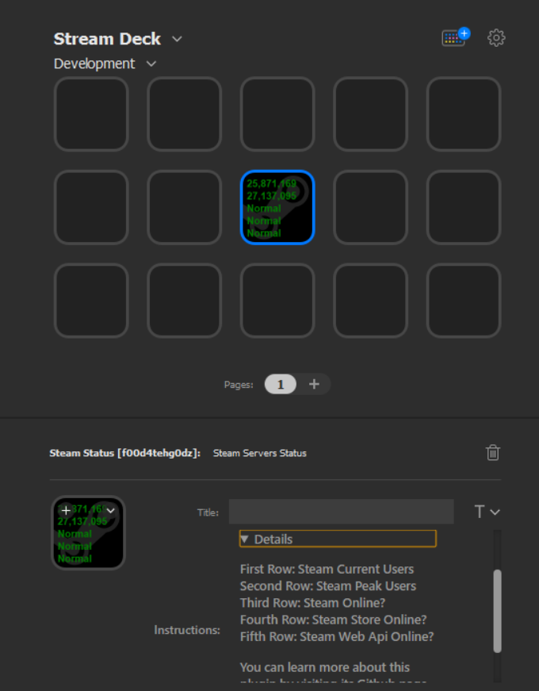

# Steamstat.us Unofficial Plugin for Elgato Streamdeck

View Steamstat.us Data using Steamstat.us Unoffcial API

This an extension for the [ElGato-StreamDeck](https://www.elgato.com/en/gaming/stream-deck).

## Screenshot

Please report any issues you see on the project's Github page. I welcome any feedback.

## Installation

Download from Release folder [Release Folder](Release/com.f00d4tehg0dz.Steamstat.us-UnOfficial-API.streamDeckPlugin)

Double click to install to StreamDeck. 

## Ongoing work
